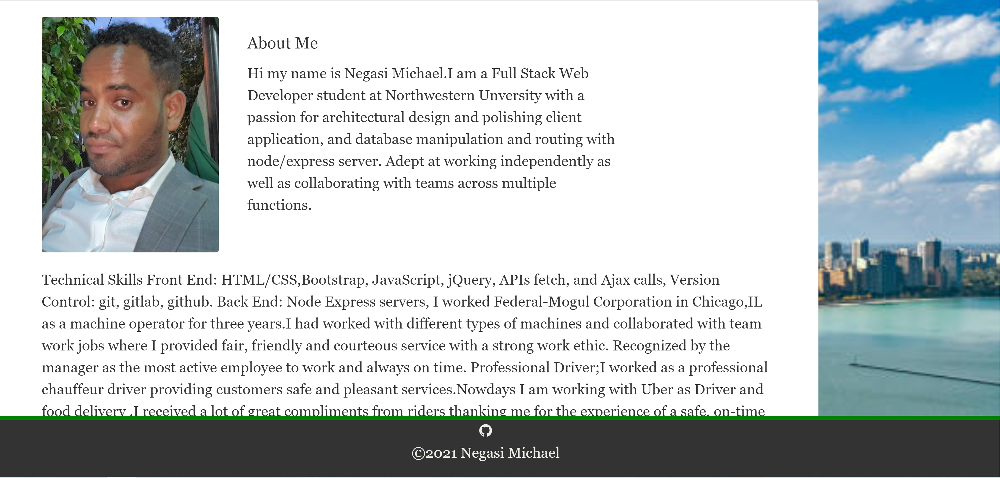
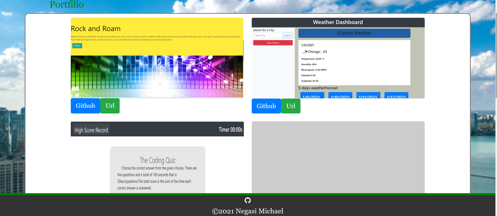

# portfilio

I create the following files files: `index.html`, `portfolio.html` and `contact.html`.

* Using Bootstrap, develop your portfolio site with the following items:

   * A navbar
   * A responsive layout
   * Responsive images
   I Used Bootstrap's grid system (containers, rows, and columns

 

 

 

URL https://negasimichael.github.io/Portfolio/
